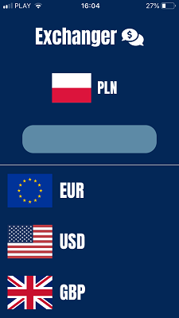
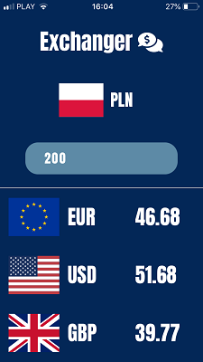
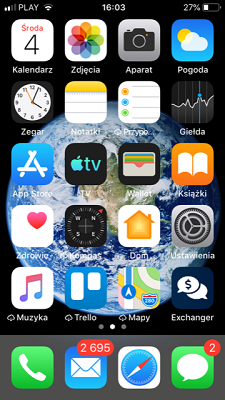

## EXCHANGER app by [@Maciekbe89](http://github.com/Maciekbe89)!

### Hello

It is my another mobile app! but this time I created it in REACT :boom: In EXCHANGER you can check current exchange rate of polish zloty to three most popular carrencies:

euro :euro:
dollar :dollar:
british pound :pound:

 

It works well in multiple resolutions. The app has also nice icon on home screen :moneybag:

### Thanks!
